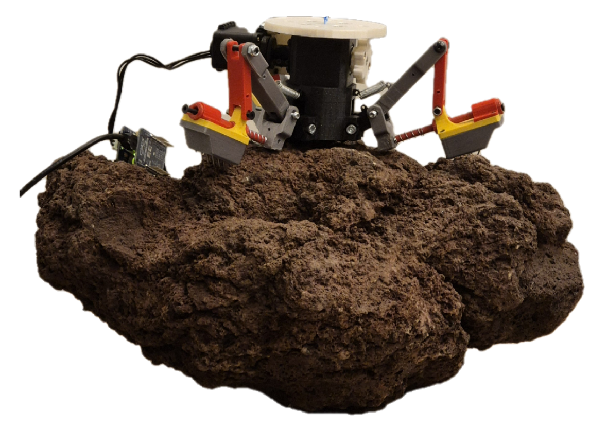

# Development of a Robotic Gripper for Microgravity Applications

<p align="center">
  
</p>

This repository contains the hardware designs, firmware, control software, and data evaluation for a functioning prototype of an underactuated robotic gripper designed for applications in microgravity. 

The gripper was developed as part of a Bachelor's Thesis, and is intended to be integrated into **Spacehopper**, an autonomous robot designed to jump in microgravity and reorient in the air to land safely. 

## Testing the Gripper

Here is a video of the final gripper mechanism in action:


## Design Objectives

The mechanical design of this gripping mechanism aimed to fulfill three primary points for reliable use on varied terrain in space:
1. **Reliable static gripping:** Ensure safe attachment to various relevant surfaces after jumping.
2. **Sufficient shock absorption:** Protect structural integrity during dynamic impacts with the surface.
3. **Passive engagement:** Ability to autonomously and passively initiate the grasping sequence once surface contact is established.

## Repository Structure

This repository is structured for modularity and easy reproduction. You'll find everything you need to build the physical gripper, program its microcontroller, and evaluate its physical performance using the custom ROS control interface.

```text
Robotic-Gripper-for-Microgravity/
├── hardware/                 # Everything needed to physically build the gripper
│   ├── Gripper_V06.stl       # Full 3D Assembly Model (Interactive in browser)
│   ├── cad/                  # Source CAD files (e.g., .prt, .stp, .3mf) 
│   │   └── design_iterations/# Historical CAD files for previous gripper versions (V01-V05)
│   └── stl/                  # Ready-to-print 3D models for the individual parts
│
├── firmware/                 # Code that runs directly on the microcontrollers
│   └── ax12a_controller/     # Arduino code (.ino) for Dynamixel AX-12A motors
│
├── software/                 # High-level software, ROS nodes, and testing scripts
│   └── franka_ft_reader/     # ROS package containing the controller nodes and measurement logger
│
├── data_evaluation/          # Data collected during physical testing on different rock types
│   ├── notebooks/            # Jupyter notebooks containing the evaluation scripts and plots
│   └── raw_data/             # Raw .csv logs from the Franka arm tests
│
└── docs/                     # Documentation and final reports
    ├── Climbing_robotic_gripper_report.pdf # Final detailed Bachelor Thesis report
    └── Final_Presentation_Slides.pdf       # Summary presentation of the project
```

## Hardware & Manufacturing

**[Click here to view the Interactive 3D Assembly Model of the Gripper](hardware/Gripper_V06.stl)**

> **Important Note regarding CAD vs. Physical Prototype:**
> The `Gripper_V06.prt` file represents the final *modeled* iteration of the design. However, during physical testing, spontaneous and rapid modifications had to be made to the gripper legs to achieve a functional grip. These final manual adjustments are **not** reflected in the CAD files, but can be seen in the photographs within the final thesis report. 

The physical prototype is composed of custom 3D printed parts and off-the-shelf Dynamixel Actuators. 
* To print your own parts, head over to `hardware/stl`. 
* To modify the design, refer to the CAD source files inside `hardware/cad`. 
* Detailed assembly instructions, kinematic diagrams, and mechanical analysis can be found inside the final report located in `docs/`.

## Software & Testing

The `software` directory contains the `franka_ft_reader` ROS package. This package was used to drive a Franka Emika Panda robotic arm to perform repeatable, precise force interactions with the gripper against various asteroid-analog rock samples (Asphalt, Limestone, Volcanic Lava Rock, Breccia, Slate, and Sediment). 

### Dependencies
* ROS Noetic (or compatible)
* [franka_ros](https://frankaemika.github.io/docs/franka_ros.html)

## Data & Evaluation

Detailed evaluations of the grip strength, spine angles (40 to 90 degrees), and dynamic shock responses are provided in the `data_evaluation` directory. 
* **Raw test data:** Available as `.csv` logs under `data_evaluation/raw_data`.
* **Plots and analysis:** Jupyter Notebooks demonstrating exactly how the data was cleaned and analyzed are located in `data_evaluation/notebooks`.

---
## License and Copyright

This project is licensed under the MIT License. This means you are free to use, copy, modify, merge, publish, distribute, sublicense, and/or sell copies of the software and hardware designs, provided that the original copyright notice and permission notice are included in all copies or substantial portions of the work.

*Copyright (c) 2024 Fiona Martin and Simon Ramchandani. Created as part of a Bachelor's Thesis project affiliated with the ETH Robotic Systems Lab.*